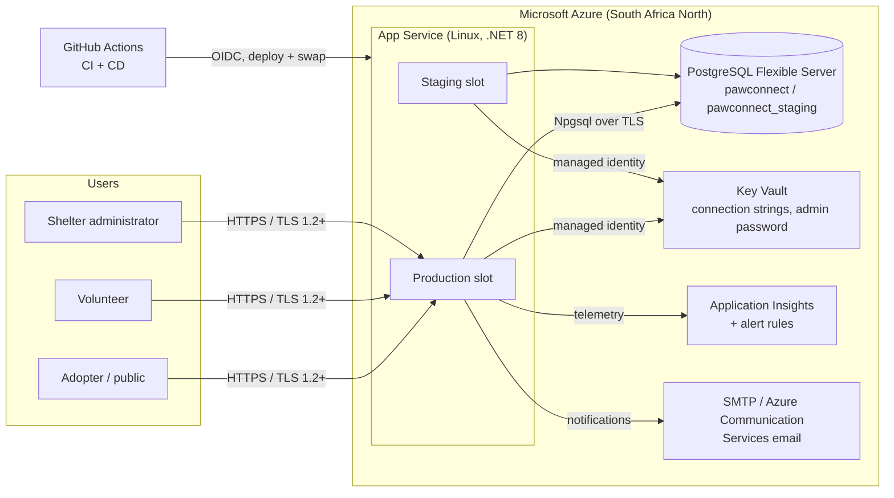
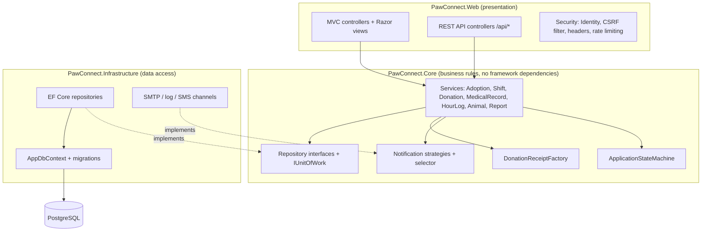
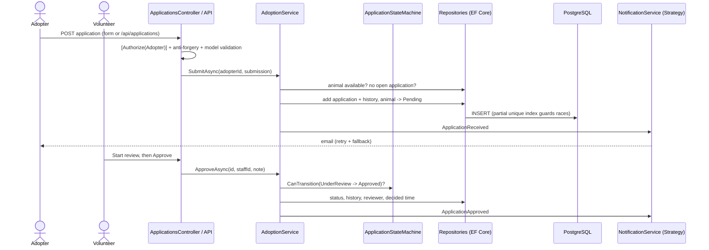
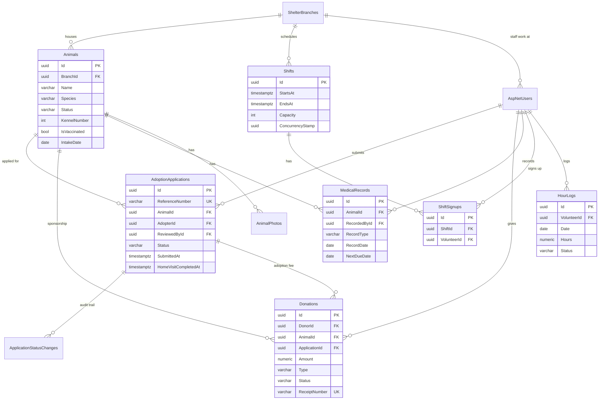

# PawConnect architecture & technical decisions

This document explains **what** was built and **why**. It supports the hosting rationale, the architecture and system design discussion, and the security and DevOps explanation in the Task 2 presentation.

## 1. System overview

## 2. Layered architecture (inside the app)

**Dependency rule:** Core depends on nothing else. Web and Infrastructure depend on Core. Swapping PostgreSQL, email providers or the UI never touches the business rules, which is why every service can be unit tested against in-memory repositories.

**Why a monolith?** Design doc 6.2 compared a monolith, microservices and serverless. For one shelter with about 20 volunteers, a single deployable app is the cheapest to host, the simplest to operate after handover, and meets the 500 ms performance NFR without cold starts. The strict layering keeps it modular, so a module could be split out later if the shelter grows to several branches.

## 3. Key flow: submit and approve an adoption application

## 4. Data model

**Integrity and performance features**
| Feature | Purpose |
|---|---|
| Partial unique index `IX_AdoptionApplications_AnimalId_Active` (`WHERE Status IN ('Submitted','UnderReview','Approved')`) | Guarantees at most one open application per animal, even if two people submit at the same instant |
| Unique `(ShiftId, VolunteerId)` + `Shift.ConcurrencyStamp` concurrency token | No double booking and no overbooking under concurrent sign-ups |
| `ConcurrencyStamp` on `AdoptionApplications` and `Animals` (optimistic concurrency) | If a volunteer approves at the moment the adopter withdraws, the second save is refused with a 409 instead of silently overwriting the first |
| Partial unique index `IX_Animals_BranchId_KennelNumber_InCare` (`WHERE Status IN ('Available','Pending')`) | One animal per kennel among animals in the shelter; an adopted or fostered animal's kennel can be reused |
| Partial unique index `IX_AnimalPhotos_AnimalId_Primary` (`WHERE IsPrimary`) | Exactly one cover photo per animal |
| Partial unique index `IX_Donations_ApplicationId_AdoptionFee` (`WHERE Type = 'AdoptionFee'`) | A double-click can't record the adoption fee twice |
| CHECK constraints: amounts > 0, hours 0–24, capacity 1–50, shift ends after it starts, kennel 1–9999, age 0–360 months, next-due ≥ treatment date, photo size ≤ 2 MB, every enum column limited to its defined values | The database refuses invalid data even if a bug or hand-written SQL bypasses the C# validation |
| Unique `ReferenceNumber`, `ReceiptNumber` | Human-friendly references that never collide |
| Indexes on `(Status, Species)`, `(BranchId, KennelNumber)`, `DonatedAt`, `(VolunteerId, Date)`, `StartsAt` | Every filter and report query uses an index |
| `numeric(10,2)` money, `timestamptz` (UTC) times, `date` for calendar days | Correct money and time-zone handling (shown in SAST) |
| Enums stored as text | The database is readable and queryable by hand |
| Restrict / SetNull / Cascade chosen per relationship | You can't delete an animal that has applications; photos go with their animal; volunteer hours (an audit record) can't be deleted with an account |

All of these are proven against a real PostgreSQL 16 database in CI by `tests/PawConnect.Tests/Database/PostgresIntegrityTests.cs` (the in-memory test provider can't enforce them).

## 5. Technology decisions

| Decision | Chosen | Alternatives considered | Rationale |
|---|---|---|---|
| Web framework | **ASP.NET Core 8 MVC + Web API** | React SPA + Express (Task 1 plan) | The Task 1 prototype was already ASP.NET Core; one language (C#) across all layers; server-rendered pages are fast on low-end phones and need no separate static-site hosting; .NET 8 is an LTS release |
| Database | **PostgreSQL 16** (Azure Flexible Server, Burstable B1ms) | MySQL, Cosmos DB | Relational integrity and partial indexes; cheapest managed tier; kept from the design doc |
| ORM | **Entity Framework Core 8** + Npgsql | Dapper, raw ADO.NET | Parameterised queries by default (injection-safe), migrations, and the in-memory provider for tests |
| Authentication | **ASP.NET Core Identity** (cookies + bearer tokens) | Azure AD B2C | Built in and free; Microsoft stopped selling Azure AD B2C to new customers in 2025; gives hashing, lockout, security stamps and roles out of the box |
| Photos | Stored in PostgreSQL (`bytea`, 2 MB cap) | Azure Blob Storage | Every slot and instance sees the same files and backups include them. The volume is tiny for one shelter. Blob Storage can be added later behind `AnimalService` |
| Notifications | SMTP strategy (Azure Communication Services) | SendGrid, SMS-first | Email is almost free; SMS plugs in as another strategy when budget allows |
| Hosting | **Azure App Service (Linux)** + deployment slots | Azure Container Apps, AKS, a VM, Render | Fully managed (patching, TLS, scaling), native .NET support, zero-downtime slot swaps, managed identity to Key Vault, and a nonprofit credit route (design doc 9) |
| Secrets | **Azure Key Vault** references + managed identity | App settings, GitHub secrets | No secret in source control or pipeline logs; access is audited |
| CI/CD | **GitHub Actions** with OIDC | Azure DevOps | Free for this project, next to the code, and passwordless Azure login |
| Infrastructure | **Bicep** (`infra/main.bicep`) | Portal clicks, Terraform | Repeatable, reviewable, native to Azure (design doc OWASP A05: infrastructure as code) |

## 6. Hosting: reliability and performance measures

- **Zero-downtime releases:** the new version is deployed to the staging slot, warmed up and smoke-tested, then swapped into production. If the post-swap health check fails, the pipeline swaps back automatically.
- **Health checks:** `/health` runs a pooled `SELECT 1` against PostgreSQL. App Service's health check pings it and replaces unhealthy instances, and the pipeline's smoke test uses it too.
- **Sticky slot settings:** each slot keeps its own `ConnectionStrings:PawConnect`, `ASPNETCORE_ENVIRONMENT`, demo-data and seed-password settings, so production never talks to the staging database and staging never holds the production admin password.
- **The right build, provably:** every build is stamped with its commit id and `/version` reports it. Before swapping, the production job checks the staging slot is running *exactly* its commit (a `develop` deploy may have landed in the shared slot meanwhile); after the swap it checks production does, and swaps back if not.
- **Notifications in the background:** services queue emails and return immediately; a hosted worker sends them with retry and fallback, so a slow mail server never slows a page.
- **Resilience:** the Npgsql connection has retry-on-failure enabled; notifications retry with exponential backoff and fall back from SMS to email; notification failures never undo a business action.
- **Sessions survive restarts and swaps:** data-protection keys are stored in PostgreSQL, so users stay signed in.
- **Backups:** automated daily backups with 7-day point-in-time restore (NFR Backup & Recovery).
- **Monitoring:** Application Insights for requests, failures and dependencies, structured JSON logs with a request trace id, and email alerts for server errors and average response time above 1 s (design doc 8.3).
- **Performance:** Brotli/gzip for CSS, JS and JSON (a 66% smaller API payload); year-long immutable caching of versioned static files; 30-day caching of photos; `AsNoTracking` read queries; projections so photo bytes are never loaded for listings; a one-minute memory cache for the home page stats.

**Measured response times** (local Release build on PostgreSQL 16, 300 requests, 10 concurrent; Azure adds network latency):

| Endpoint | p50 | p95 | NFR |
|---|---|---|---|
| `GET /health` | 20 ms | 79 ms | < 500 ms ✓ |
| `GET /` | 54 ms | 102 ms | < 500 ms ✓ |
| `GET /Home/Browse` | 59 ms | 109 ms | < 500 ms ✓ |
| `GET /api/animals` | 35 ms | 62 ms | < 500 ms ✓ |
| `GET /api/animals?species=Dog&available=true&kids=true` | 41 ms | 85 ms | < 500 ms ✓ |

Re-measure on Azure after deployment and add the figures (Application Insights → Performance).

## 7. Security architecture

| Layer | Controls |
|---|---|
| Transport | HTTPS only, TLS 1.2+, HSTS, HTTP→HTTPS redirect |
| Browser | CSP `script-src 'self'` (no inline script anywhere), X-Frame-Options DENY, nosniff, Referrer-Policy, Permissions-Policy |
| Authentication | Identity: PBKDF2 salted hashes, password policy, lockout after 5 failures for 15 minutes, rate limiting of 10 requests per minute per IP on login, register and token (429 + `Retry-After`), security-stamp revalidation every 5 minutes, deactivation (only revealed to someone who knows the password, so accounts can't be enumerated) |
| Authorisation | Role-based `[Authorize]` on every controller and API; ownership checks (applications, donations, receipts, withdrawals) answer **404** so ids can't be probed; volunteers are limited to their own branch's applications (`BranchAccess`, pages and API); admins can't remove their own admin role |
| Integrity | Optimistic concurrency tokens, CHECK constraints and partial unique indexes in PostgreSQL (section 4); enums accepted by name only |
| Input | DataAnnotations on every form and DTO, validated again inside the services; image type detected from file bytes; CSV-injection neutralisation |
| CSRF | Anti-forgery tokens on all form posts; cookie-authenticated API writes must send `X-CSRF-TOKEN`; bearer-token clients are exempt (not exposed to CSRF) |
| Data | Parameterised SQL (EF Core); PII encrypted at rest (Azure PostgreSQL); secrets in Key Vault; managed identities; POPIA consent, privacy notice and data export |
| Supply chain | CI fails on NuGet packages with known vulnerabilities; Dependabot opens weekly update PRs |

## 8. Accessibility

Every page is audited automatically in CI (`tests/accessibility/axe_audit.py`, axe-core, WCAG 2.1 AA + best practice) for all roles at desktop and mobile widths. The current result is **0 violations**. Measures include:
- colour pairs of at least 4.5:1 contrast;
- a logical heading order and landmarks;
- a skip link and visible keyboard focus;
- labels on every input;
- `aria-live` result counts and toasts;
- keyboard-operable controls, with the frequency toggle built from real radio buttons;
- focusable scroll regions;
- `prefers-reduced-motion` support;
- a responsive layout from 360 px to desktop.
